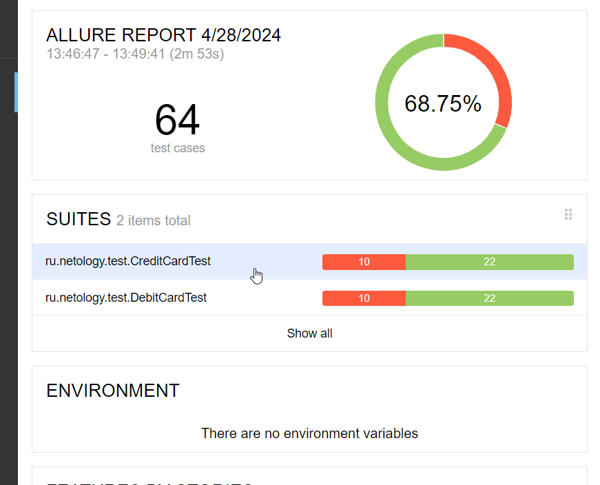

# Отчет по результатам тестирования  
***
## Краткое описание: ##
В рамках работы над проектом было проведено комплексное тестирование веб-сервиса, который предоставляет пользователям возможность приобретения туров двумя способами. Тестирование проходило в два этапа: первоначальное ручное тестирование и последующее автоматизированное тестирование, согласно написанному и утвержденному сценарию авто-тестов. Сервис взаимодействует с базами данных MySQL и PostgreSQL (результаты тестов одинаковые для обеих баз данных), а также использует API Банка.  
## Общее количество авто-тестов: ##
В ходе автоматизированного тестирования были проведены как позитивные, так и негативные сценарии покупки туров, включая тесты баз данных. Общее количество тест-кейсов составило 64 тестов.  
*Из которых:*  
-успешно пройденные: 44 теста (68,75%);  
-непройденные: 20 тестов (31,25%).  
На все **непройденные** (в т.ч. и при ручном тестировании) тесты заведены баг-репорты в разделе [Issues](https://github.com/Maksim-Shalaev/Diploma/issues) 

  

## Общие рекомендации:  
-составить детальную документацию для данного сервиса;  
-исправить выявленные дефекты (см. [Issues](https://github.com/Maksim-Shalaev/Diploma/issues));  
-добавить изменение цвета кнопок "Купить" и "Купить в кредит" при переключении между двумя вкладками для удобства пользования;  
-изменить (либо добавить) на соответствующие "подсказки" под незаполненными полями ввода (см. [Issues](https://github.com/Maksim-Shalaev/Diploma/issues/5)).  

